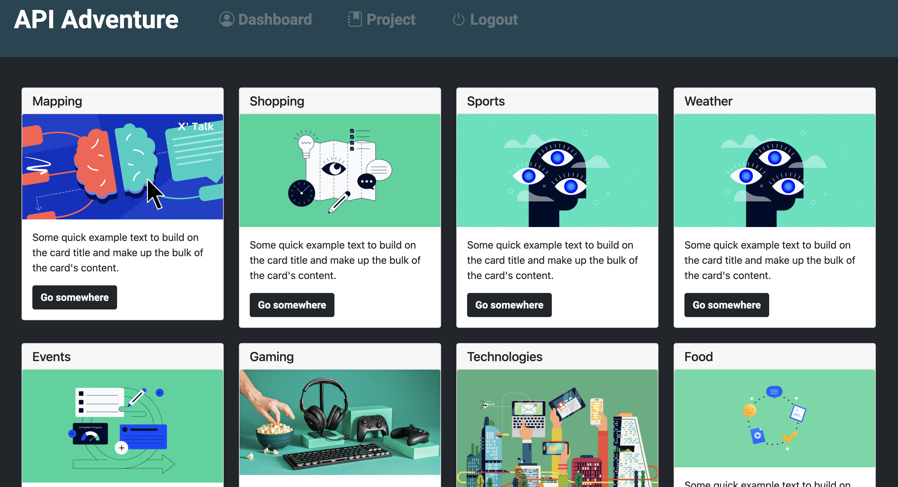

# API-Adventures 

[Link to deployed site](#)

## Technology Used:

 * HTML - https://developer.mozilla.org/en-US/docs/Web/HTML
 * CSS - https://developer.mozilla.org/en-US/docs/Web/CSS
 * JavaScript -  https://developer.mozilla.org/en-US/docs/Web/JavaScript 
 * BootStrap - https://getbootstrap.com
 * npm - https://www.npmjs.com/
 * mysql2 - https://www.npmjs.com/package/mysql2
 * sequelize - https://sequelize.org/
 * express - https://expressjs.com/
 * express-handlebar - https://www.npmjs.com/package/express-handlebars
 * express-session - https://www.npmjs.com/package/express-session
 * dotenv - https://www.npmjs.com/package/dotenv
 * handlebars - https://handlebarsjs.com/
 * bcrypt - https://www.npmjs.com/package/bcrypt
 * MVC - https://developer.mozilla.org/en-US/docs/Glossary/MVC
 * Unsplash API - https://unsplash.com/developers

 ## Description:

 ## Table of Contents:
  
   * [Installation](#installation)
   * [Usage](#usage)
   * [Highlighted Features](#highlighted-features)
   * [Learning Points](#learning-points)
   * [License](#license)
   * [Badges](#badges)
   * [Tests](#tests)
   * [Contributing](#contributing)
   * [Authors](#authors)

## Installation:
  
* To install all dependencies, run: npm install
* Create the database in MYSQL using the schema.sql.
* To load the seeds into the database, run: npm run seed 
* To start the server, run: node server.js

## Usage:

**Home page Input**

---

**Resource Index**

---

**My Dashboard**

---

**Login/Signup**

---

**Create Resource**

---

**Create Project**

---

### Highlighted Features:

 **Random Photo Search:**

 This application utilizes the Unsplash API to get a random photo and sets it as a Project or resource category profile image.  The Unsplash API allows us to filter the searches and retrieve a random photo for the user and a search a topic related photo for the resource category.

 below is code snippet to get a random Photo based on

  
    const url = `https://api.unsplash.com/photos/random?query=${category_id}&orientation=squarish&client_id=${api_Key}`;

    try {
    const unsplashResponse = await fetch(url);
    const unsplashData = await unsplashResponse.json();
    const image_url = unsplashData.urls.small;

    const response = await fetch(`/api/resource`, {
      method: "POST",
      body: JSON.stringify({image_url,}),
      headers: {
        "Content-Type": "application/json",
      }
    })
   } catch (error) {
    console.error("Error fetching photo from Unsplash:", error);
    alert("Failed to fetch photo from Unsplash");
   }

---

## Learning Points:

## License:

 This project is licensed with MIT license

 Link to License - [Website to MIT License]((https://opensource.org/license/mit))

 ## Badges:

 

 

 

 

 

 

 

 

 

 ## Tests:
 
 This application tested the the front end and backend routes using Insomnia Core application

  

 ## Contributing:

 

 ## Authors:

 Anna Rose Benedetti

 - [Portfolio](https://abenedetti27.github.io/Portfolio/)
 - [LinkedIn](https://www.linkedin.com/in/anna-rose-benedetti/)
 - [GitHub](https://github.com/abenedetti27)

 Armando Arujo

 - [Portfolio](https://armand57araujo.github.io/Portfolio/)
 - [LinkedIn](https://www.linkedin.com/in/armand-araujo-a82ba2291/)
 - [GitHub](https://armand57araujo.github.io/Portfolio/)

 Thai Nghiem

 - [Portfolio](#)
 - [LinkedIn](https://www.linkedin.com/in/thai-nghiem-319292267/)
 - [GitHub](https://github.com/Truecoding4life)

 Andy Zurek

 - [Portfolio](https://azurek17.github.io/zurek-portfolio/)
 - [LinkedIn](https://www.linkedin.com/in/andy-zurek-374bb9291/)
 - [GitHub](https://github.com/AZurek17)
