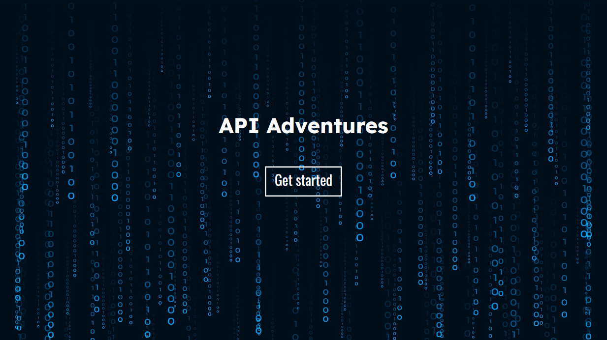
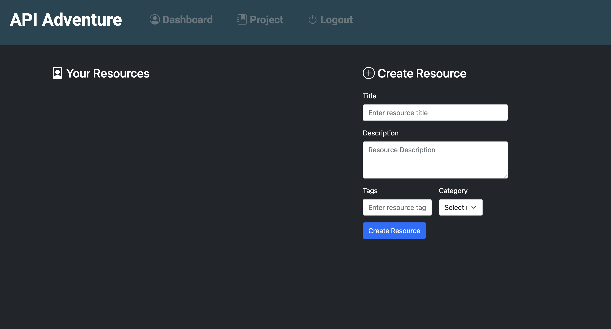
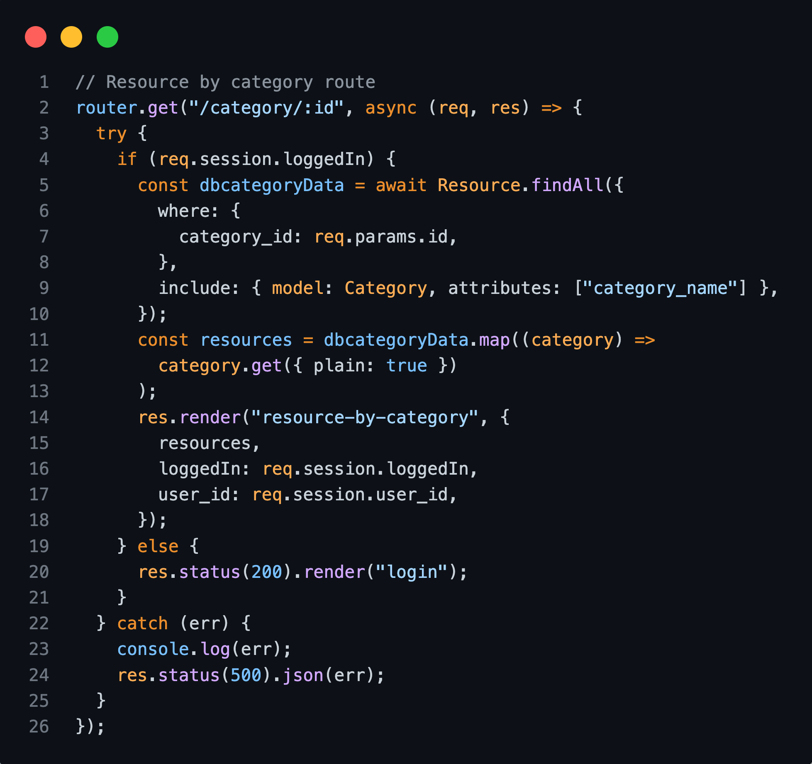
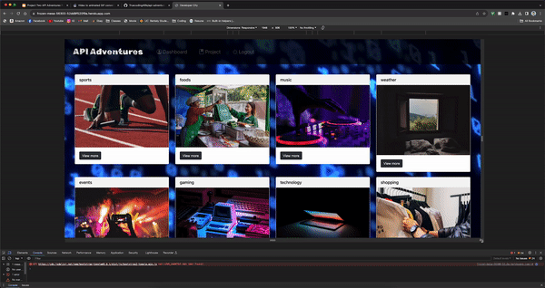
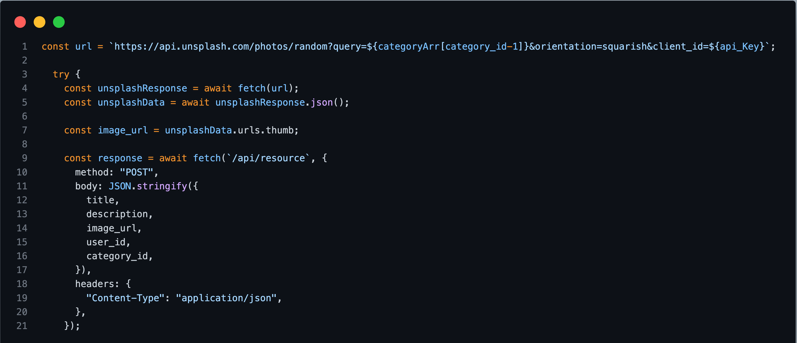

# API-Adventures 

#### Resources:

[Link to live site](https://api-adventures-cd9e93b14d5e.herokuapp.com)

---

#### Technology Used:

[more detail](https://github.com/)

[more detail](https://www.heroku.com/platform)

[more detail](https://developer.mozilla.org/en-US/docs/Web/HTML)

[more detail](https://developer.mozilla.org/en-US/docs/Web/CSS)

[more detail](https://developer.mozilla.org/en-US/docs/Web/JavaScript)

[more detail](https://getbootstrap.com)

[more detail](https://www.npmjs.com/)

 * [mysql2](https://www.npmjs.com/package/mysql2resource)
 * [sequelize](https://sequelize.org/)
 * [express](https://expressjs.com/)
 * [express-handlebar](https://www.npmjs.com/package/express-handlebars)
 * [express-session](https://www.npmjs.com/package/express-session)
 * [dotenv](https://www.npmjs.com/package/dotenv)
 * [handlebars](https://handlebarsjs.com/)
 * [bcrypt](https://www.npmjs.com/package/bcrypt)
 * [MVC](https://developer.mozilla.org/en-US/docs/Glossary/MVC)
 * [Unsplash API](https://unsplash.com/developers)

-----

 #### Description:
API Adventures is an API index by category, for developers, with the ability to save API resources to a user dashboard, create new API resources and add to the index. It is a full-stack web application built using Node.js, Express.js, and MySQL, following the MVC paradigm to ensure a structured and maintainable codebase. It offers a secure and interactive platform with RESTful API endpoints for data retrieval and addition. The application employs Handlebars.js as the templating engine for dynamic content rendering.

#### User Stories:
1. As a User, I want to Get Started, so that I can login or sign up.

2. As a User, I want to log in with a secured account using my email
3. As a User, I want to see API resource posts by category , so that I can use api for my webpage
4. As a User, I want to create a resource post, so that I can share about the insight of this new api.
5. As a User, I want to create a project post, so that I can share a project utilizing a new api.

6.  As a User, I want to view all my resource post on my dashboard, so that I remember what I posted.
7. As a User, I want to click on a resource on homepage, so that I can see details of the post.
8. As a User, I want to update /delete/archive my resource post, so that I can modify my resource post.

----

#### Table of Contents:
  
 * [Installation](#installation)
 * [Usage](#usage)
 * [Highlighted Features](#highlighted-features)
 * [Learning Points](#learning-points)
 * [License](#license)
 * [Badges](#badges)
 * [Tests](#tests)
 * [Contributing](#contributing)
 * [Authors](#authors)

---

#### Installation:
  
* To install all dependencies, run: npm install
* Create the database in MYSQL using the schema.sql.
* To load the seeds into the database, run: npm run seed 
* To start the server, run: node server.js

----

### Usage

**Home Page**

The homepage provides users with a streamlined experience to enter the API index within the site.

---

**Login/Sign Up**

Existing users have the ability to log in and new users have the ability to sign up. 

---

**Resource Index**

The resource index provides users with an at-a-glance view of all of the resource categories. Each API resource is assigned a category to correspond with it's use-case. 

---

**My Dashboard**

Each user has a dashboard, which can be accessed after logging in.

---

**Create Resource**

Resources can be added to a user's dashboard by creating a resource.

---

**Create Project**

Projects can be created and added to a user's dashboard by creating a project.

---

### Highlighted Features:

**RESTful API:** Utilizing Node.js and Express.js, the application provides both GET and POST routes to facilitate seamless interaction with the database.

**Database Integration:** MySQL is employed as the relational database, and Sequelize ORM streamlines data management, ensuring efficient and organized storage.

**Deployment on Heroku:** API Adventures is hosted on Heroku, ensuring accessibility and scalability. The deployment includes the necessary data, ensuring a fully functional application.

**Polished UI:** The user interface is thoughtfully designed, adhering to best practices in user experience. It ensures an intuitive and visually appealing interaction for users.

**Responsiveness:** The application is responsive, adapting seamlessly to various screen sizes and devices, providing an optimal user experience.

**Interactivity:** API Adventures engages users by accepting and responding to their inputs. It fosters dynamic interactions to enhance user engagement.

**MVC Folder Structure:** Following the MVC paradigm, the project maintains a well-organized folder structure. Models, views, and controllers are distinct and logically organized, promoting code maintainability.

**Authentication with Express-Session and Cookies:** User authentication is a priority, implemented using Express-session and cookies. This ensures secure access to user-specific data and actions.

**Environment Variable Security:** API keys and sensitive information are protected using environment variables, adding an extra layer of security to the application.

**Clean Repository:** The project repository adheres to quality coding standards. It demonstrates consistency in file structure, naming conventions, and follows best practices for class and ID naming, indentation, and includes high-quality comments for code documentation.

 **Random Photo Search Technology:** This application utilizes the Unsplash API to get a random photo and sets it as a Project or Resource category profile image.  The Unsplash API allows us to filter the searches and retrieve a random photo for the user and a search a topic related photo for the resource category.

---

## Learning Points:
1. Handlebars.js: Gain proficiency in using Handlebars.js as a templating engine for dynamic content rendering. Understand its syntax and how it integrates with Node.js and Express.js.

2. MVC Paradigm: Implement the MVC (Model-View-Controller) paradigm to organize code efficiently, separating concerns and promoting maintainability.

3. Authentication: Implement user authentication using express-session and cookies to secure access to user-specific data and actions.

4. Deployment on Heroku: Understand the process of deploying a Node.js application on Heroku, including configuring environment variables and ensuring the deployment includes necessary data for a fully functional application.

5. Environment Variable Security: Learn to protect sensitive information, such as API keys, by using environment variables, adding an extra layer of security to the application.

6. Testing with Insomnia: Use tools like Insomnia for testing frontend and backend routes, ensuring proper functionality and identifying potential issues.

----

#### License:

 This project is licensed with MIT license

 Link to License - [Website to MIT License]((https://opensource.org/license/mit))

-----

 ## Tests:
 
 This application tested the the front end and backend routes using Insomnia Core application

  
 
 ## Authors:

 Anna Rose Benedetti

 - [Portfolio](https://abenedetti27.github.io/Portfolio/)
 - [LinkedIn](https://www.linkedin.com/in/anna-rose-benedetti/)
 - [GitHub](https://github.com/abenedetti27)

 Armando Arujo

 - [Portfolio](https://armand57araujo.github.io/Portfolio/)
 - [LinkedIn](https://www.linkedin.com/in/armand-araujo-a82ba2291/)
 - [GitHub](https://armand57araujo.github.io/Portfolio/)

 Thai Nghiem

 - [Portfolio](https://main--j-studio-rjs.netlify.app/)
 - [LinkedIn](https://www.linkedin.com/in/thai-nghiem-319292267/)
 - [GitHub](https://github.com/Truecoding4life)

 Andy Zurek

 - [Portfolio](https://azurek17.github.io/zurek-portfolio/)
 - [LinkedIn](https://www.linkedin.com/in/andy-zurek-374bb9291/)
 - [GitHub](https://github.com/AZurek17)
# API-One-Stop

Project Requirements

Use Node.js and Express.js to create a RESTful API.

Use Handlebars.js as the template engine.

Use MySQL and the Sequelize ORM for the database.

Have both GET and POST routes for retrieving and adding new data.

Be deployed using Heroku (with data).

Use at least one new library, package, or technology that we haven’t discussed.

Have a polished UI.

Be responsive.

Be interactive (i.e., accept and respond to user input).

Have a folder structure that meets the MVC paradigm.

Include authentication (express-session and cookies).

Protect API keys and sensitive information with environment variables.

Have a clean repository that meets quality coding standards (file structure, naming conventions, follows best practices for class/id naming conventions, indentation, quality comments, etc.).

Have a quality README (with unique name, description, technologies used, screenshot, and link to deployed application).

